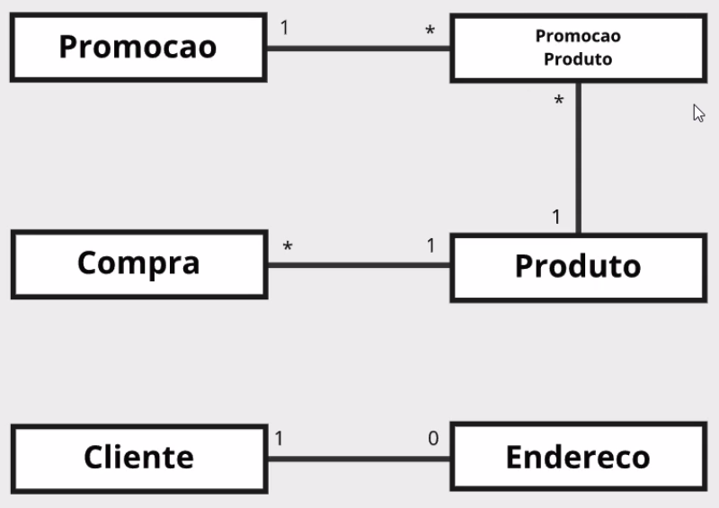

<h1>Introducao Entity Framework Core</h1>

Mapeamento de nossas classes:
  

<ol>
<li>Instalação do Pacote NuGet EntityFrameworkCore 1.1.1</li>
<li>
Operações CRUD
<ul>
<li>DbSet.Add()</li>
<li>DbSet.Update()</li>
<li>DbSet.Delete()</li>
</ul>
</li>
<li>
Select
<ul>
<li>DbSet.ToList()</li>
<li>DbSet.First()</li>
<li>DbSet.Last()</li>
</ul>
</li>
<li>Estado de Modificação -> DbContext.ChangeTraker</li>
<li>
  Trabalhando com migrations
  <ul>
    <li>Install-Package Microsoft.EntityFramework.Tools</li>
     <li>Add-Migration</li>
     <li>Remove-Migration</li>
     <li>Update-Database</li>
  </ul>
  </li>
  <li>
  Trabalhando com Join
  <ul>
    <li>Include()</li>
    <li>ThenInclude()</li>
    <li>Load()</li>
  </ul>
  </li>
</ol>
